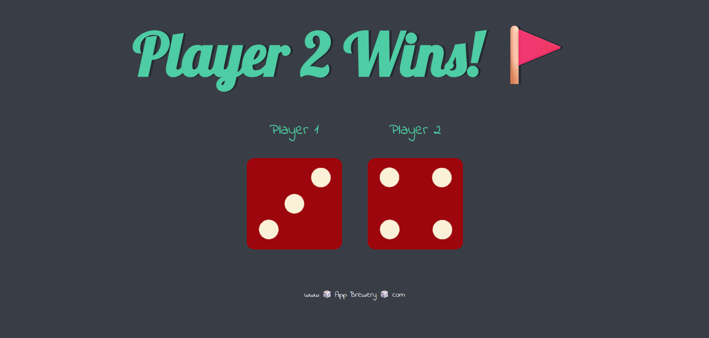
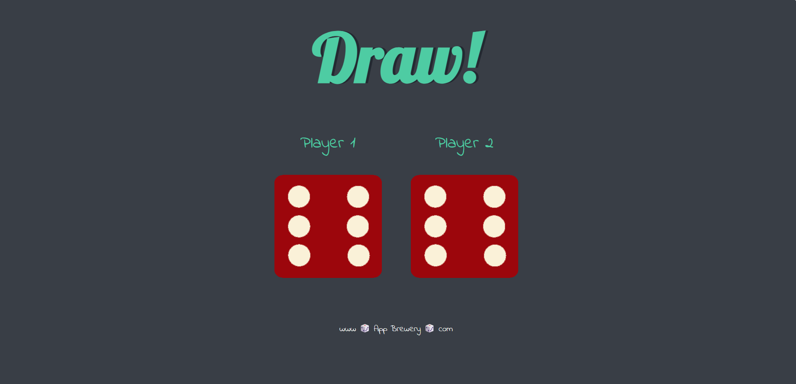

# 🎲 Dice Challenge Game

A fun and simple web-based dice game built using **HTML**, **CSS**, and **JavaScript**. Click **refresh** or use the **Roll Dice** button to roll two dice and determine which player wins — or if it's a draw!

## 🧠 What I Learned

- DOM Manipulation using JavaScript
- Generating random numbers
- Working with HTML image elements dynamically
- Styling using custom fonts and CSS properties
- Using Git and GitHub for version control
- Project structure and file organization

## 📸 Screenshots

Here are a few snapshots of the Dice Challenge Game in action:

### 🔁 Dice Rolled - Player 1 Wins


### 🔁 Dice Rolled - Player 2 Wins


### 🤝 Draw Situation



## 🚀 How to Run the Game

1. Clone the repository:
   ```bash
   git clone https://github.com/KiranKolavi01/Dice-Challenge-Game.git

## 📁 Project Structure

Dice-Challenge-Game/
├── images/
│ ├── dice1.png
│ ├── ...dice6.png
│ ├── Screenshot1.png
│ ├── Screenshot2.png
│ └── Screenshot3.png
├── index.html
├── index.js
├── styles.css
└── README.md


## 🙌 Acknowledgements

This project is part of my learning journey through web development. Inspired by beginner JavaScript challenges and personal curiosity!


